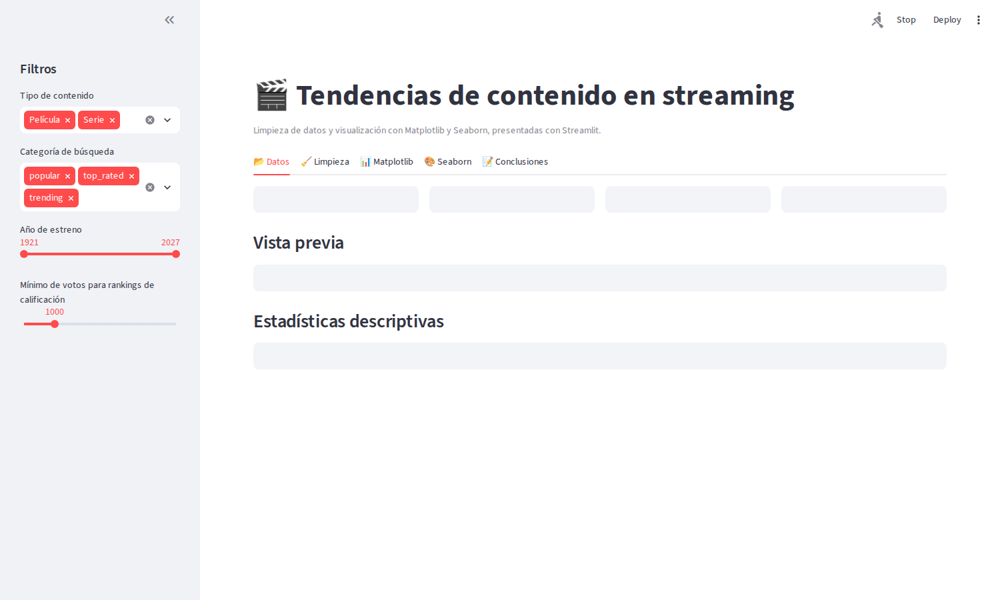
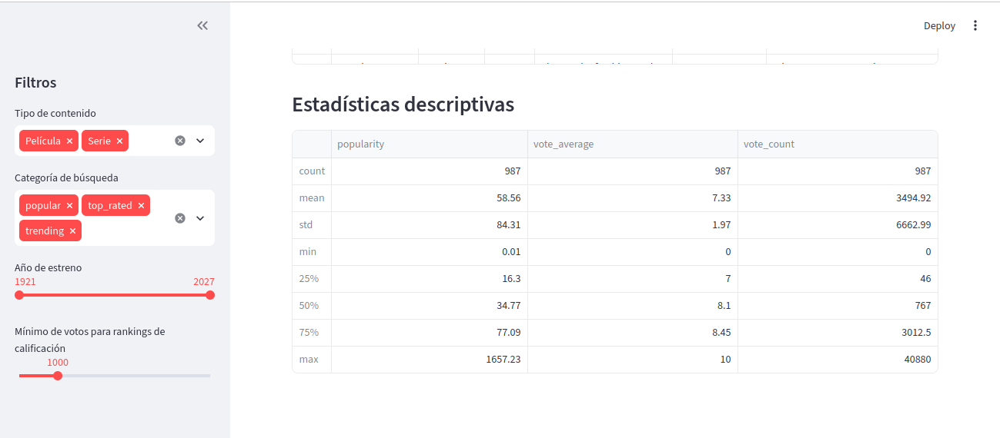
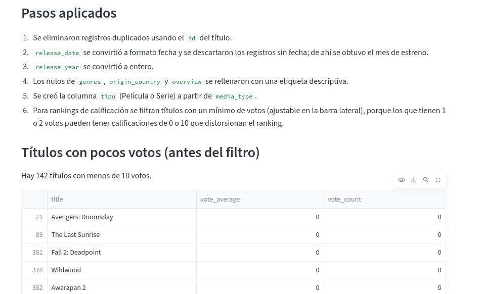
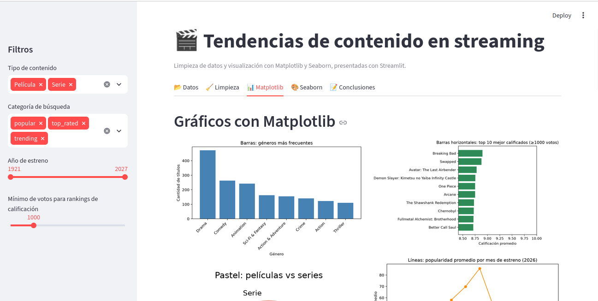
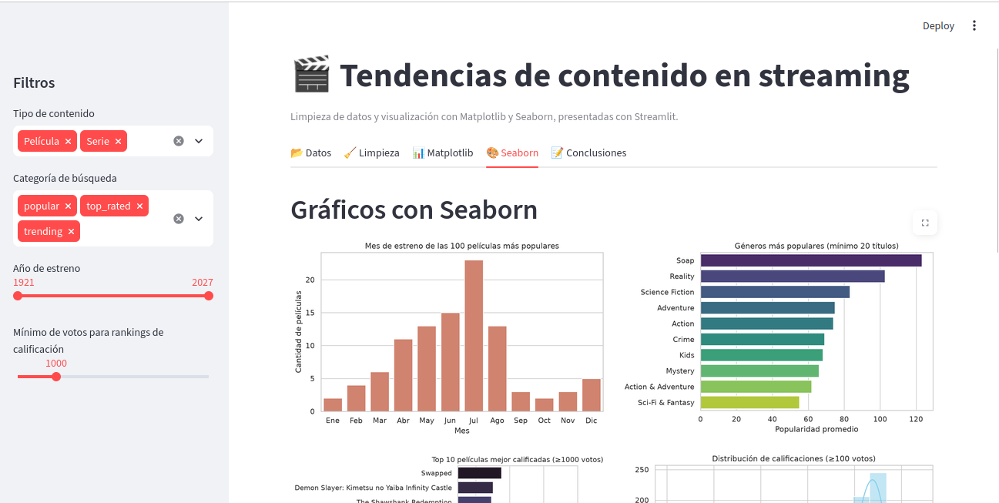
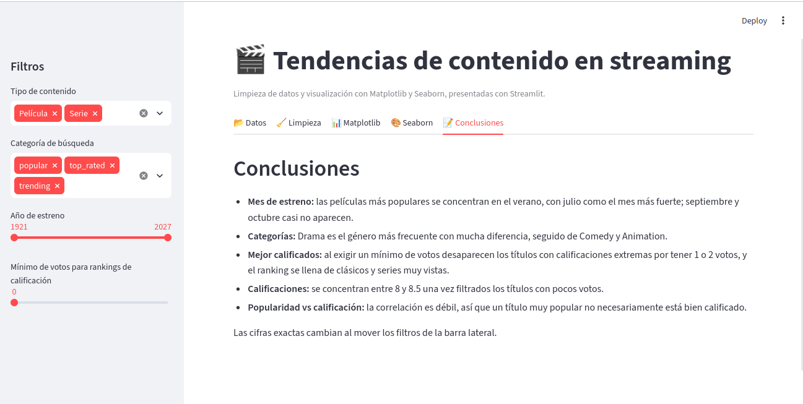

# Tendencias de contenido en streaming

Aplicación web hecha con **Streamlit** que continúa la actividad de preprocesamiento y visualización de datos. Toma la base `streaming_content_trends.csv` (películas y series con su popularidad, calificación, género y fecha de estreno), la limpia y muestra las gráficas hechas con **Matplotlib** y **Seaborn** en una interfaz con filtros interactivos.

Este documento tiene dos partes: cómo instalar y correr el proyecto, y un recorrido con capturas de todo lo que ofrece la app, para poder verla sin necesidad de instalarla.

## Contenido del repositorio

| Archivo | Descripción |
| --- | --- |
| `app.py` | Código de la aplicación de Streamlit |
| `streaming_content_trends.csv` | Base de datos que usa la app |
| `requirements.txt` | Librerías que necesita el proyecto |
| `docs/img/` | Capturas de pantalla usadas en este documento |

## 1. Instalación

### Requisitos

- **Python 3.10 o superior.** Se puede revisar con `python --version` (en algunos sistemas el comando es `python3`).
- **Git**, solo si se va a clonar el repositorio. Si no, se puede descargar el proyecto como ZIP desde el botón verde **Code** de GitHub.
- Conexión a internet para instalar las librerías.

Las librerías que se instalan con `requirements.txt` son:

| Librería | Para qué se usa |
| --- | --- |
| `streamlit` | Interfaz web de la aplicación |
| `pandas` | Carga y limpieza de los datos |
| `numpy` | Cálculos numéricos (por ejemplo, el radar) |
| `matplotlib` | Gráficas básicas |
| `seaborn` | Gráficas estadísticas |

### Pasos

**1. Obtener el proyecto**

```
git clone https://github.com/<usuario>/<repositorio>.git
cd <repositorio>
```

**2. Crear un entorno virtual** (recomendado, para no mezclar las librerías con las del resto del sistema)

En Linux o macOS:

```
python3 -m venv venv
source venv/bin/activate
```

En Windows (PowerShell):

```
python -m venv venv
venv\Scripts\Activate.ps1
```

En Windows (CMD):

```
python -m venv venv
venv\Scripts\activate.bat
```

Cuando el entorno queda activo, el terminal muestra `(venv)` al inicio de la línea.

**3. Instalar las librerías**

```
pip install -r requirements.txt
```

**4. Ejecutar la aplicación**

```
python -m streamlit run app.py
```

Se abre el navegador en `http://localhost:8501` con la app. Si no se abre sola, basta copiar esa dirección en el navegador. Para detener la app se presiona `Ctrl + C` en el terminal.

### Notas importantes

- **No se ejecuta con el botón "play" de VS Code** ni con `python app.py`. Una app de Streamlit necesita su propio servidor, y de la otra forma solo aparecen avisos como `missing ScriptRunContext` y no se abre nada. Siempre se lanza con `python -m streamlit run app.py`.
- La primera vez, Streamlit puede pedir un correo electrónico. Se puede dejar vacío y presionar Enter.
- `app.py` busca el archivo `streaming_content_trends.csv` en la misma carpeta. Si no lo encuentra, la propia app muestra un botón para subirlo.

### Problemas frecuentes

| Síntoma | Solución |
| --- | --- |
| `streamlit: command not found` | El entorno virtual no está activo, o se instaló fuera de él. Activarlo y usar `python -m streamlit run app.py`. |
| `ModuleNotFoundError` al abrir la app | Faltan librerías en el entorno activo. Repetir `pip install -r requirements.txt`. |
| Aparece la página de demostración "Hello" | Esa pantalla sale con el comando `streamlit hello`. Usar `python -m streamlit run app.py`. |
| El puerto 8501 está ocupado | Usar otro: `python -m streamlit run app.py --server.port 8502`. |

## 2. Qué ofrece la aplicación

La app tiene una **barra lateral con filtros** y cinco pestañas. Los filtros afectan a todas las gráficas y tablas al mismo tiempo.



### Barra lateral: filtros

- **Tipo de contenido:** películas, series o ambos.
- **Categoría de búsqueda:** `popular`, `top_rated` y `trending`, que es de dónde se obtuvo cada título.
- **Año de estreno:** rango de años a considerar.
- **Mínimo de votos:** número de votos que debe tener un título para entrar a los rankings de calificación. Por defecto es 1000.

Si los filtros dejan la base vacía, la app lo avisa y pide ampliar la selección en lugar de marcar error.

### Pestaña Datos

Muestra cuántos títulos hay con los filtros actuales (en total, películas y series), la calificación promedio, una vista previa de las primeras filas y las estadísticas descriptivas de popularidad, calificación y número de votos.



### Pestaña Limpieza

Documenta el preprocesamiento de los datos: registros iniciales y finales, duplicados eliminados, una tabla con los valores nulos de cada columna antes y después de limpiar, y la lista de pasos aplicados. También muestra los títulos con menos de 10 votos, que explican por qué los rankings de calificación se filtran por número de votos: un título con uno o dos votos puede tener calificación de 0 o de 10 y distorsionar el resultado.



### Pestaña Matplotlib

Nueve gráficas hechas con Matplotlib: barras (géneros más frecuentes), barras horizontales (top 10 mejor calificados), pastel (películas contra series), líneas (popularidad promedio por mes de estreno en 2026), dispersión (votos contra calificación), histograma, áreas (estrenos por mes en 2026), boxplot (calificación por categoría de búsqueda) y radar (porcentaje de títulos por género, películas contra series).



### Pestaña Seaborn

Seis gráficas hechas con Seaborn: el mes de estreno de las 100 películas más populares, los géneros más populares por popularidad promedio, el top 10 de películas mejor calificadas, el histograma de calificaciones con curva de densidad, un boxplot de calificación por tipo y categoría, y un mapa de calor con la correlación entre popularidad, calificación y votos.



### Pestaña Conclusiones

Resume lo que se observa en las gráficas: el verano concentra los estrenos más populares, Drama es el género más frecuente, las calificaciones se concentran entre 8 y 8.5 una vez filtrados los títulos con pocos votos, y la popularidad casi no se relaciona con la calificación.



## Datos

La base `streaming_content_trends.csv` tiene 988 registros y 14 columnas, entre ellas título, tipo de contenido, géneros, fecha de estreno, popularidad, calificación promedio y número de votos.
